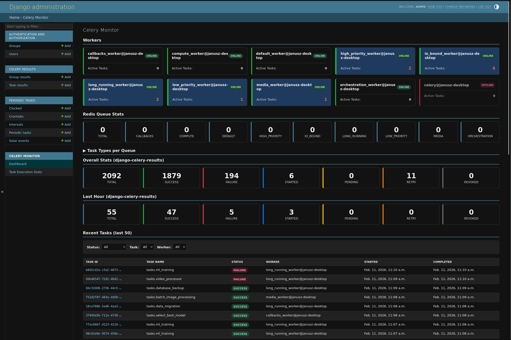

# Django Celery Monitor

A Django app for admin-based Celery task monitoring with real-time updates.



## Requirements

- Python >= 3.12
- Django >= 5.2
- Celery >= 5

## Installation

### Using uv (recommended)

```bash
uv add git+https://github.com/ordergroup/django-celery-monitor.git
```

## Quick Start

### 1. Add to Installed Apps

Add `celery_monitor` to your `INSTALLED_APPS` in `settings.py`:

```python
INSTALLED_APPS = [
    # ...
    'django.contrib.admin',
    'celery_monitor',
    # ...
]
```

### 2. Run Migrations

```bash
python manage.py migrate celery_monitor
```

### 3. Configure URLs

The app integrates with Django admin automatically. Just make sure you have admin URLs configured:

```python
from django.contrib import admin
from django.urls import path

urlpatterns = [
    path('admin/', admin.site.urls),
]
```

### 4. Access the Dashboard

Start your Django development server and navigate to:

```
http://localhost:8000/admin/celery_monitor/
```

## Optional: Django Celery Results Integration

For enhanced monitoring with task history and execution statistics, install `django-celery-results`:

```bash
pip install django-celery-results
```

Add it to your `INSTALLED_APPS`:

```python
INSTALLED_APPS = [
    # ...
    'django_celery_results',
    'celery_monitor',
    # ...
]
```

Configure Celery to use it as the result backend:

```python
# celery.py
CELERY_RESULT_BACKEND = 'django-db'
```

Run migrations:

```bash
python manage.py migrate django_celery_results
```

## Optional: PostgreSQL Optimization

If using PostgreSQL, you can create a materialized view for better performance on large datasets:

```bash
python manage.py migrate celery_monitor
```

This creates a `CeleryStatusCount` materialized view that caches status counts.

