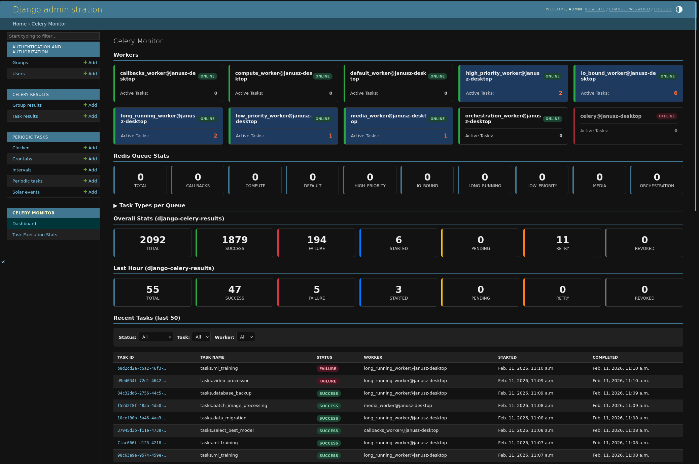

# Django Celery Monitor

A Django app for admin-based Celery task monitoring with real-time updates.



## Requirements

- Python >= 3.10
- Django >= 4.2
- Celery >= 5

## Installation

### Using uv (recommended)

```bash
uv add git+https://github.com/ordergroup/django-celery-monitor.git
```

## Quick Start

### 1. Add to Installed Apps

Add `celery_monitor` to your `INSTALLED_APPS` in `settings.py`:

```python
INSTALLED_APPS = [
    # ...
    'django.contrib.admin',
    'celery_monitor',
    # ...
]
```

### 2. Run Migrations

```bash
python manage.py migrate celery_monitor
```

### 3. Configure URLs

The app integrates with Django admin automatically. Just make sure you have admin URLs configured:

```python
from django.contrib import admin
from django.urls import path

urlpatterns = [
    path('admin/', admin.site.urls),
]
```

### 4. Access the Dashboard

Start your Django development server and navigate to:

```
http://localhost:8000/admin/celery_monitor/
```

## Backend Options

Django Celery Monitor supports multiple backends for storing task execution data. Choose the one that best fits your infrastructure:

### Option 1: Django Celery Results

For persistent task history and execution statistics with database storage:

```bash
pip install django-celery-results
```

Add it to your `INSTALLED_APPS`:

```python
INSTALLED_APPS = [
    # ...
    'django_celery_results',
    'celery_monitor',
    # ...
]
```

Configure Celery to use it as the result backend:

```python
# celery.py
CELERY_RESULT_BACKEND = 'django-db'
CELERY_TASK_TRACK_STARTED = True  # Enable execution time tracking


# you can also use django-db as your celery backend but still use
# redis for celery monitor purposes
CELERY_MONITOR_RESULTS_BACKEND = "redis"
# or
CELERY_MONITOR_RESULTS_BACKEND = "celery_results"
# or just dont set it, it will use celery_results by default in such case.
```

Run migrations:

```bash
python manage.py migrate django_celery_results
```

### Option 2: Redis Backend

For monitoring without requiring django-celery-results, you can use Redis with a custom monitoring schema:

**Step 1: Configure Celery with Redis**

```python
# settings.py or celery.py
CELERY_BROKER_URL = 'redis://localhost:6379/0'
# or
CELERY_RESULT_BACKEND = 'redis://localhost:6379/1'

# set this if you have `django-celery-results` installed and want to use redis as celery monitor backend
CELERY_MONITOR_RESULTS_BACKEND = "redis"
```

`CELERY_RESULT_BACKEND` has priority over `CELERY_BROKER_URL`, so you can use different databas for backend.

**Configuration Options:**

```python
# settings.py

# How long raw task data (details, payloads) is kept in Redis.
# Applies to: task detail hashes, task payload keys, recent tasks index entries.
# Default: 7 days
DJANGO_CELERY_MONITOR_TASK_DATA_TTL = 7 * 24 * 60 * 60  # seconds

# How long pre-computed stats are kept in Redis.
# Applies to: per-bucket stats, rollup stats, throughput buckets, and their indexes.
# Default: 7 days
DJANGO_CELERY_MONITOR_STATS_TTL = 7 * 24 * 60 * 60  # seconds
```

**Periodic Stats Computation (Celery Beat):**

The dashboard's task execution stats and throughput charts are powered by pre-computed data.
To keep them up to date, schedule `calculate_celery_stats` in your Celery Beat config:

```python
# settings.py
from celery.schedules import crontab

CELERY_BEAT_SCHEDULE = {
    "celery-monitor-stats": {
        "task": "celery_monitor.redis.tasks.calculate_celery_stats",
        "schedule": crontab(minute="*/30"),  # every 30 minutes
    },
}
```

The task is incremental by default — it only processes tasks added since the last run.
Pass `overwrite=True` to recompute everything from scratch:

```python
from celery_monitor.tasks import calculate_celery_stats

calculate_celery_stats.delay(overwrite=True)
```

Or trigger it manually from the dashboard using the **Compute stats** button.

### Option 3: Base Monitor (No Additional Backend)

If neither django-celery-results nor Redis is configured, the monitor will still work with limited functionality.

## Backend Selection Priority

The monitor automatically detects and uses the best available backend. You can control this with the `CELERY_MONITOR_RESULTS_BACKEND` setting:

```python
# settings.py

# Explicitly set the backend (optional)
CELERY_MONITOR_RESULTS_BACKEND = "celery_results"  # Use django-celery-results
# or
CELERY_MONITOR_RESULTS_BACKEND = "redis"  # Use Redis custom backend
# or leave unset for automatic detection
```

**Automatic Detection Priority (when `CELERY_MONITOR_RESULTS_BACKEND` is not set):**

1. **Django Celery Results** (if `django-celery-results` is installed)
2. **Redis** (if Redis is configured in `CELERY_BROKER_URL` or `CELERY_RESULT_BACKEND`)
3. **Base** (fallback with limited functionality)

## Dashboard Configuration

```python
# settings.py

# How often the dashboard auto-refreshes, in seconds.
# Default: 60
DJANGO_CELERY_MONITOR_DASHBOARD_REFRESH_INTERVAL = 60
```

## Optional: PostgreSQL Optimization

If using PostgreSQL, you can create a materialized view for better performance on large datasets:

```bash
python manage.py migrate celery_monitor
```

This creates a `CeleryStatusCount` materialized view that caches status counts.

## Development

### Running Tests Locally

This project uses [tox](https://tox.wiki/) to test multiple configurations. Tests are run against different settings to ensure compatibility with and without optional dependencies.

#### Install Development Dependencies

```bash
uv sync --all-extras --dev
```

#### Run All Test Environments

```bash
uv run tox
```

This runs tests in 4 configurations:
- `py312-base` - Without django-celery-results
- `py312-celeryresults` - With django-celery-results
- `py312-redis` - Redis broker only
- `py312-redis-celeryresults` - Redis + django-celery-results

#### Run Specific Test Environment

```bash
# Test without django-celery-results
uv run tox -e py312-base

# Test with django-celery-results
uv run tox -e py312-celeryresults

# Test with Redis configuration
uv run tox -e py312-redis
```

#### Run Tests Directly with pytest

```bash
# Default configuration (no django-celery-results)
uv run pytest tests/ -v

# With django-celery-results
uv run pytest tests/ -v --ds=tests.settings_with_celery_results

# With Redis settings
uv run pytest tests/ -v --ds=tests.settings_redis
```

#### Code Quality Checks

```bash
# Run ruff linter
uv run ruff check celery_monitor tests

# Run ruff formatter
uv run ruff format celery_monitor tests

# Check formatting without changes
uv run ruff format --check celery_monitor tests
```

